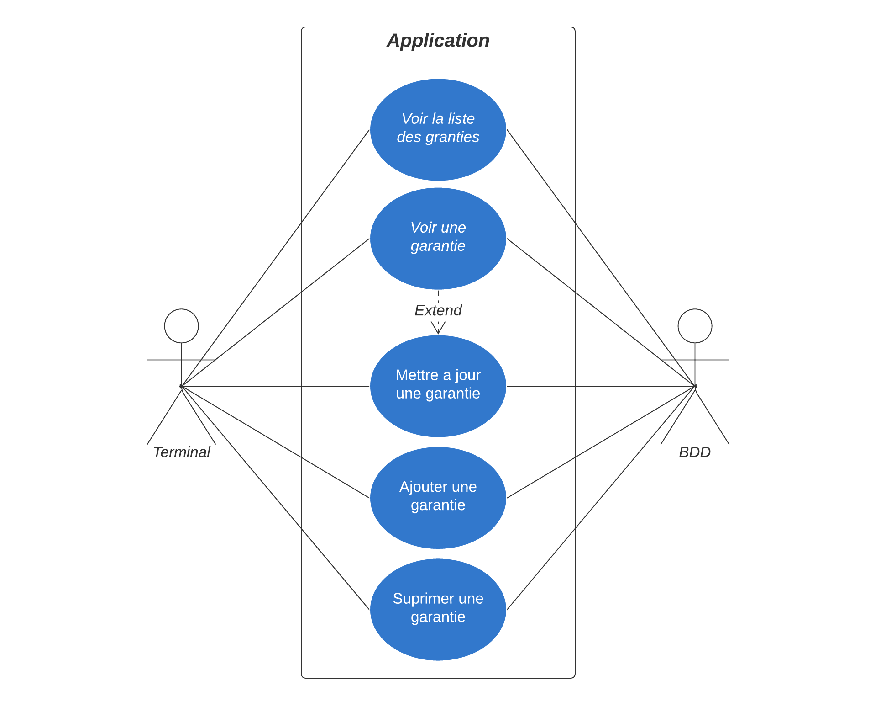
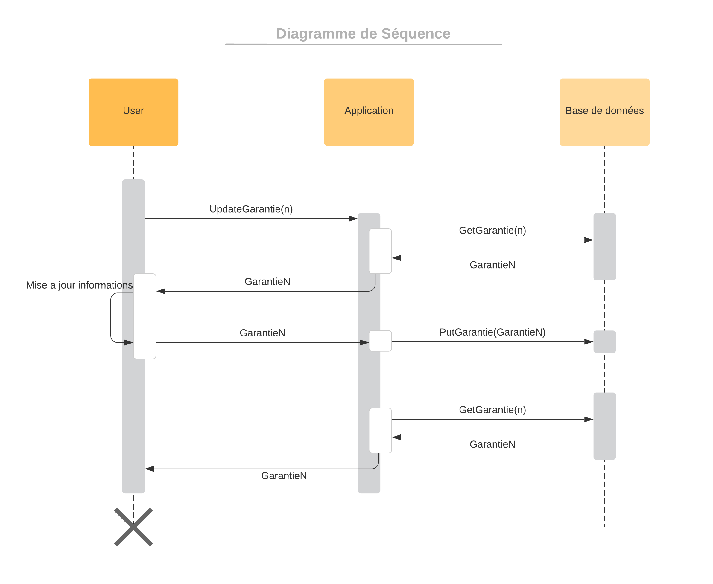
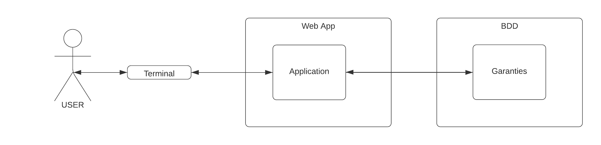

# TP1_Architecture_REST
TP1 de la matière Architecture Logicielle mettant en oeuvre une API REST

# Licence
Publié sous [Licence MIT](LICENSE)

# Fonctionnalités

## Technologie
Cette application utilise une base de Java Spring Boot avec Maven.

## API REST

1. Lancer le programme, le serveur se lance sur `http://localhost:8080/`
2. L'API se trouve sur l'adresse `api/garantie`

| Adresse | GET                     | POST                        | PUT                       | DELETE                  |
| :------ | :---:                   | :----:                      | :---:                     | :------:                |
| /       | Lister les garanties    | Créer une nouvelle garantie | X                         | X                       |
| /id     | Récupère la garantie id | X                           | Met à jour la garantie id | Supprime la garantie id |

# Diagrammes

## Diagramme de cas d'utilisation (utilisation du service)

	

## Diagramme de séquence (mise à jour d'un produit)

	

## Diagramme de composant (architecture)

	

